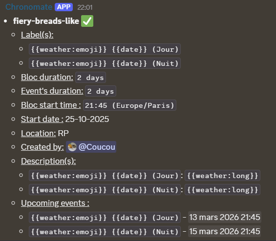

# /schedule
Create and manage recurring cycles of Discord Scheduled Events.

Requires: **Manage Events** permission (and channel permissions for Stage/Voice events).

## Subcommands
- **create** — define a cycle; opens a wizard to enter labels, optional descriptions, and optional banner images
- **list** — show active cycles and a few upcoming events
- **pause** — pause a cycle (stops creating new events; existing ones remain)
- **cancel** — delete a cycle and purge its future events (also deletes linked events on Discord when possible)
- **edit** — edit an existing cycle (see below)

## create
> [!usage]
> **`/schedule create [%count] [bloc] [start_time] [len] (location_elsewhere) (location_channel) (start_date) (timezone)`**
> - **`count`** — number of different labels/descriptions you will provide (1–20)
> - **`bloc`** — interval between starts (e.g., `2d`, `48h`)
> - **`start_time`** — daily time in HH:MM format at which each event starts (e.g., `21:00`)
> - **`len`** — event duration (e.g., `2h`)
> - **`location_elsewhere`** — plain text location for External events
> - **`location_channel`** — a Voice or Stage channel
> - **`start_date`** — first day for the cycle (defaults to today in the chosen time zone)
> - **`timezone`** — IANA time zone name (e.g., `Europe/Paris`)

> [!TIP]
> - Provide either `location_elsewhere` or `location_channel` — not both.
> - `timezone` defaults to the date template's zone or guild settings if omitted.
> - Durations are parsed based on the bot localization set or (if not) the discord locale (aka if your discord is in english, it will use english)

### Wizard
For each label (1 → count), a modal will prompt for:

- **Label** (**required**) — event title; placeholders are supported
- **Description** (*optional*) — event details; placeholders are supported
- **Banner** (*optional*) — URL of the banner image (minimum 800×320 px recommended)

After the wizard, the bot saves the cycle and immediately starts maintaining the future event buffer.

> [!IMPORTANT]
> You can use placeholders (`{{date}}`, `{{count}}`, `{{weather:short}}`, etc.) in labels and descriptions.
> See [Templates](../user-guide/Templates.md) for the full list.

## List
> [!usage]
> **`/schedule list (id)`**
> - `id` (*optional*, autocomplete): filter by a specific schedule ID

The bot replies with a list of all active cycles. For each cycle you'll see:

- **Schedule ID** — used with pause/cancel/edit commands
- **Labels** — the event titles in this cycle
- **Bloc duration** — interval between events
- **Event duration**
- **Start time** and time zone
- **Start date** (anchor)
- **Location** — channel or external text
- **Upcoming events** — next scheduled occurrences



## Pause
> [!usage]
> **`/schedule pause [id]`**
> - `id` (**required**, autocomplete): ID of the cycle to pause. Use `all` to pause everything.

Stops new events from being created. Existing events remain in Discord. There is no resume command; to restart a paused cycle, cancel and recreate it.

## Cancel
> [!usage]
> **`/schedule cancel [id]`**
> - `id` (**required**, autocomplete): ID of the cycle to cancel; use `all` to cancel every cycle

This permanently removes the cycle and purges future events. Past events remain in Discord history.

## Edit
### Config
Edit a cycle's timing and location. Future events are recreated automatically if the block interval, start time, or time zone changes.

> [!usage]
> **`/schedule edit config [id] (bloc) (len) (start_time) (timezone) (location_elsewhere) (location_channel)`**
> - **`id`** (**required**, autocomplete) — ID of the cycle to edit
> - **`bloc`** (*optional*) — new block interval
> - **`len`** (*optional*) — new event duration
> - **`start_time`** (*optional*) — new daily start time (HH:MM)
> - **`timezone`** (*optional*) — new IANA time zone
> - **`location_elsewhere`** (*optional*) — new plain text location
> - **`location_channel`** (*optional*) — new Voice or Stage channel

When `start_time`, `timezone`, or `bloc` changes, all future events are automatically deleted and recreated.

### Blocs
Re-enter labels, descriptions, and banners for a cycle via the wizard.

> [!usage]
> **`/schedule edit blocs [id] (count)`**
> - `id` (**required**, autocomplete) — ID of the cycle to edit
> - `count` (*optional*, 1–20) — number of labels to re-enter (defaults to the current cycle length)

> [!example]
>
> ```bash
> /schedule create count:3 bloc:2d start_time:21:00 len:2h timezone:Europe/Paris location_elsewhere:Online
> /schedule list
> /schedule pause id:my-cycle-123
> /schedule cancel id:my-cycle-123
> /schedule cancel id:all
> /schedule edit config id:my-cycle-123 start_time:20:00
> /schedule edit blocs id:my-cycle-123 count:3
> ```