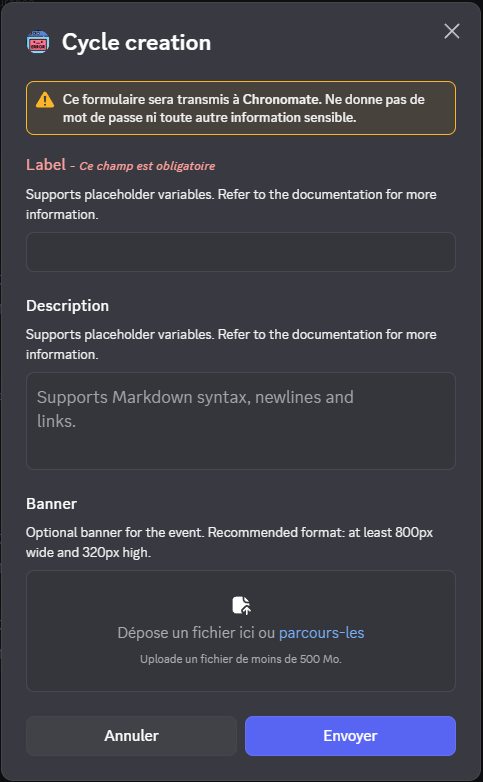

# Creating Your First Schedule
## Plan before you start
Decide:
- How many different event labels you need (`count`: 1–20)
- Interval between events (`bloc`: e.g., `2d`, `1w`)
- Daily start time (`start_time`: HH:MM, 24-hour)
- Event duration (`len`: e.g., `2h`)
- Location: a plain text string (`location_elsewhere`) or a Voice/Stage channel (`location_channel`)

## Run the create command
> [!example]
> `/schedule create count:3 bloc:2d start_time:21:00 len:2h timezone:Europe/Paris location_elsewhere:Online`

*For more information, see [create](../commands/schedule.md#create).*

## Complete the wizard
After submitting the command, a modal appears. Click **Next** to begin.



For each label (1 through count), a modal appears with:
- **Label** (required) — the event title; supports placeholders like `{{date}}` and `{{count}}`
- **Description** (optional) — event details; supports placeholders
- **Banner** (optional) — public image URL (JPEG/PNG/GIF, minimum 800×320 px recommended)

Example entries:

```
Label: 🎮 Game Night - Mario Kart Tournament
Description: Join us for an exciting Mario Kart competition!
Banner: https://example.com/mario-kart-banner.png
```

For each modal: fill it in and click **Submit**. The next modal appears automatically. After the last one, the bot confirms the cycle was created and begins generating future events.

## Verify
> [!usage]
> `/schedule list`

Within a minute, events appear in Discord's Events section (Server name → Events).


